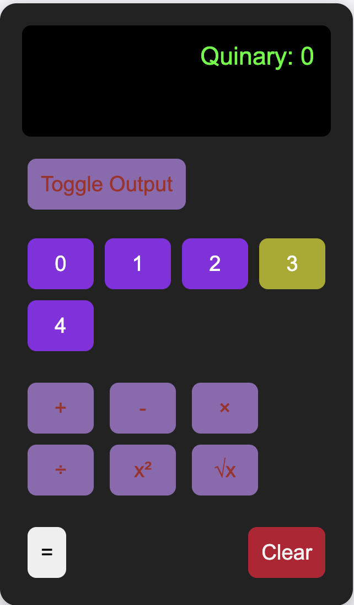

# Quinary Calcular
> ***Group 4!***

A calculator that operates in base-5 (quinary) with support for addition, subtraction, multiplication, division, square, and square root operations.

## Screenshot



## How to Use

1. **Enter Numbers:** Use the buttons labeled 0-4 to input numbers in quinary.
2. **Operations:** Select an operation (+, -, ×, ÷, x², √x) to perform calculations.
3. **Toggle Output:** Switch between different output modes using the "Toggle Output" button.
4. **Equals:** Press `=` to compute the result.
5. **Clear:** Use the "Clear" button to reset the calculator.
6. **x² (Square)**: Press this button to square the current number displayed. For example, if the display shows 3 and you press x², the result will be 14.
7. **√x (Square Root)**: Press this button to calculate the square root of the current number displayed. For example, if the display shows 4 and you press √x, the result will be 2.

## Manual

- Only digits 0-4 are valid inputs.
- The calculator displays results in quinary.
- Use the square (x²) and square root (√x) buttons for advanced operations.

## Additional Dependencies

- Make sure you have [Node.js](https://nodejs.org/) installed.
- Install project dependencies with:

## How to Run

1. **Install dependencies**  
   Open your terminal, navigate to the project directory, and run:
```bash
   npm install
   ```

2. **Open the application**  
   You can use an extension like Live Server in VSCode or simply open the `index.html` file in your browser to run the calculator.


## Team Members
> - Sinclair Nzenwata
> - Jayden Gillam
> - Ethan Buckner
> - Lleyton Parsons
> - Shristi Khadka
> - *Prof. Ergin*


## Meeting Notes Section
- 8/28/2025 7:51PM
  - Who joined: Ethan, Sinclair, Jayden
    - Zoom Meeting about assigning people tasks, and general idea of how to proceed
    - Discussed meeting with team members before doing any coding
- Meeting adjourned at 7:47PM

## Task Distribution

| Member    | Role                        | Core Responsibilities                                                                 | Features for PR (Branches)                                                                        |
|-----------|-----------------------------|--------------------------------------------------------------------------------------|---------------------------------------------------------------------------------------------------|
| Sinclair  | Connecting and Documentation| Set up the project, connect the UI with the logic, update the README.md and take meeting notes. | Feature/connection                                                                                |
| Ethan     | UI Developer 1              | Implement calculator number buttons (0-4) and basic display. Implement button styling. | Feature/UI-Dev1-EthanBuckner (Number button UI and display field)                                 |
| Jayden    | Logic Developer 1           | Implement quinary-decimal conversion logic. Implement addition and subtraction logic. Write unit tests for these operations. | Feature/quinary-arithmetic-logic-jayden (Addition and Subtraction logic and tests)                |
| Lleyton   | UI Developer 2              | Implement operation buttons (+, -, *, /, =, square, square root, toggle). Implement toggle display functionality. | Feature/OperationButtonsAndToggle (Operation button UI and toggle display)                        |
| Shristi   | Logic Developer 2           | Implement multiplication and division logic. Implement square and square root logic. Write unit tests for these operations. | Feature/advanced-arithmetic-logic (Multiplication, Division, Square, Square Root logic and tests) |

